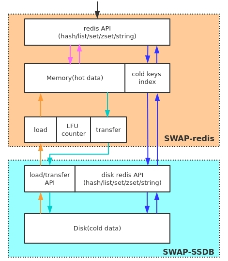

## swapdb

A redis compatiable storage which support data exchange between memory and disk, so you can save a lot of memory costs by using swapdb compared to redis. the main thought of swapdb is, keep hot keys in redis and cold keys in disk, when a key in disk becomes hot, will load it to redis, when a key in memory becomes cold, will transfter it to disk. by using swapdb, you can have both a high preformance cache and high capacity KV storage.

## Fundamental

## Features

* Heat statistics of keys(LFU)
* Configurable threshold of RAM/FLASH capacity
* Redis API compatiable(99%). supports data structures such as strings, hashes, lists, sets, sorted sets
* Cluster management(redis cluster)
* Multiple replica nodes and data replication support(RDB+Snapshot)
* Data persistency support
* High performance and high capacity redis-like storage

## Quick start

Read the [Quick Start](./docs/QUICKSTART.md).

## Applicable scenes

* cache

swapdb support LFU based heat statistics, hot keys are kept in redis，so you can use swapdb as cache, which has the same performance as redis when access hot keys.

* High capacity redis-like KV storage

By configuring a low threshold of RAM/FLASH capacity, most of the data will be stored in disk and only the hottest data stored in redis.
